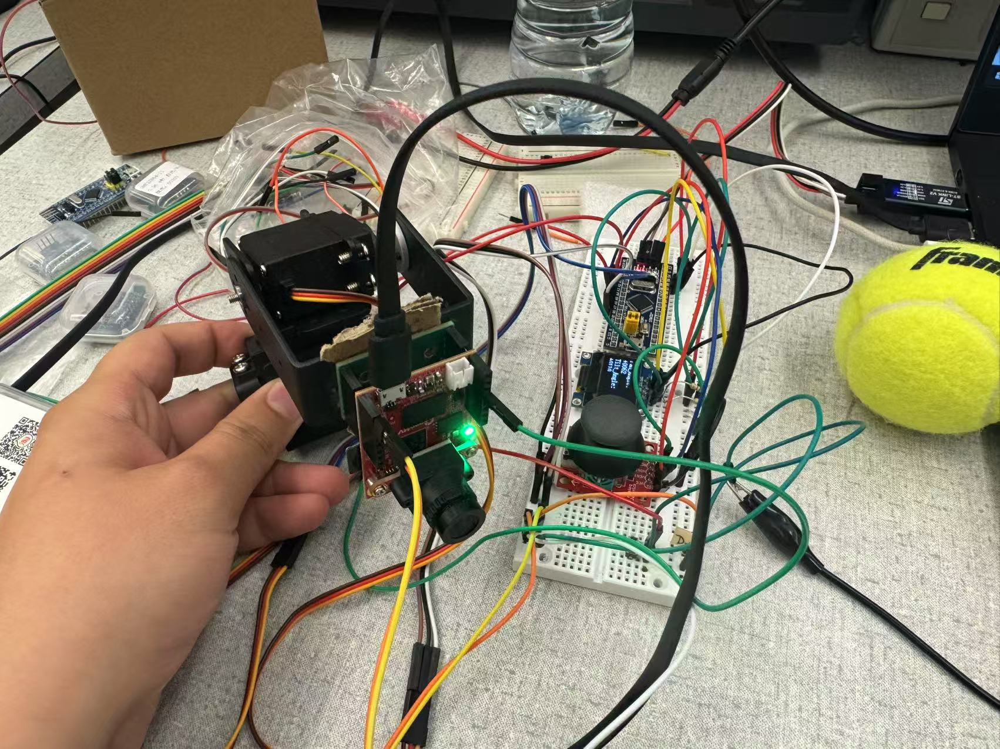
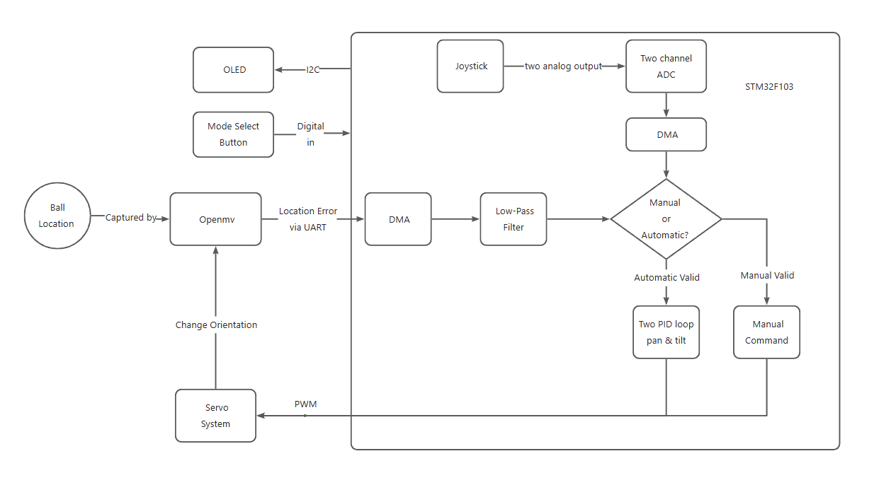

# ECE4180 Project Report

Author: Ruize Cao & Hongyu Yan

# Introduction

Our project is an automatic ball-tracking system designed to detect and follow a ball within the camera’s field of view. The system is composed of five main components: a pan-tilt servo mechanism, an OpenMV camera, an OLED display, a joystick, and an STM32F103 microcontroller. An overview of the system setup is shown below. Potential applications for this project include security monitoring, mobile robotics, and related fields.

# Description of each component

- The pan-tilt system is driven by two MG995 servos, which receive PWM signals from the microcontroller to adjust the camera’s position and orientation. This allows the system to keep the ball centered within the camera’s view.
- An OLED display is used to present important information, such as the current pan and tilt angles, which is helpful for debugging and monitoring system status. Communication between the OLED and the microcontroller is handled via the I2C protocol.
- The OpenMV is a compact, integrated camera system capable of running Python scripts with built-in computer vision libraries. In this project, it identifies the ball based on a predefined color threshold, highlights it with a bounding box, and calculates positional errors along the pan and tilt axes. The OpenMV communicates real-time error data to the microcontroller through the UART protocol.
- The joystick generates analog signals ranging from 0 V to 3.3 V depending on the stick's position in both the vertical and horizontal directions. These analog signals are interpreted by the microcontroller as commands to adjust the pan and tilt positions. Additionally, the joystick features a button that allows switching between automatic tracking mode and manual control mode.
- The microcontroller used is the STM32F103, a low-power, hardware-oriented controller that offers more direct hardware access compared to platforms like mbed or Arduino. It processes input signals from both the OpenMV and the joystick and generates corresponding control signals for the pan-tilt system. The firmware is developed using STM32’s Standard Peripheral Library, involving register-level programming for greater control and efficiency.

# Discussion

The data flow and communication between the controller and peripherals in our project closely mirror those of a real embedded system. This includes processes such as input signal handling with a low-pass filter and control strategies using a PID algorithm. However, one key limitation of our current design is the lack of internet connectivity, which restricts the system from being monitored or controlled remotely via Wi-Fi — a crucial feature in modern embedded systems.

There are two main areas for potential improvement. First, implementing a neural network or other computer vision techniques would allow the OpenMV camera to recognize a wider range of objects, significantly enhancing system capabilities. Second, adding internet ports would enable remote monitoring and image access for users, aligning the project more closely with real-world applications.

# Logic Flow Chart

# Circuit Diagram

